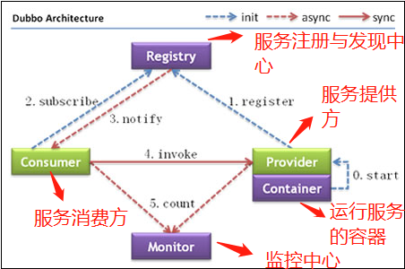

# dubbo
dubbo-test
 
我觉得主要可以从 Dubbo 提供的下面四点特性来说为什么要用 Dubbo：

1. **负载均衡**——同一个服务部署在不同的机器时该调用那一台机器上的服务
2. **服务调用链路生成**——服务之间互相是如何调用的
3. **服务访问压力以及时长统计**——当前系统的压力主要在哪里，如何来扩容和优化
4. **服务降级**——某个服务挂掉之后调用备用服务




### dubbo下载

```$xslt
 http://mirror.bit.edu.cn/apache/zookeeper/
```

zookeeper中查看消费者提供这命令：
```$xslt
# 进入zk命令行端
./zkCli.sh -server 192.168.33.128:2181

# 查看/dubbo下节点
ls /dubbo
[zk: 192.168.33.128:2181(CONNECTED) 4] ls /dubbo/com.fh.service.HelloService
[consumers, configurators, routers, providers]
```

## 易出现问题点：
1、服务生产者provider中，@Service要使用dubbo提供的注解；并且要加上@Component标记容器受spring管理。